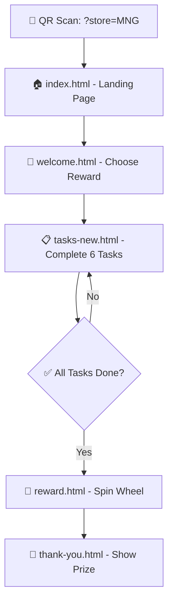
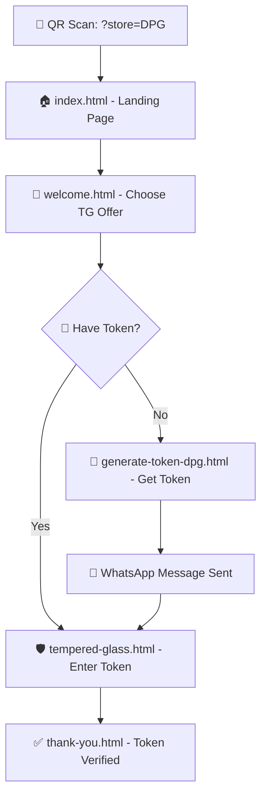

# 🏪 The Shankar Communications (TSC) QR Reward System

**🌟 Unified Multi-Store Digital Reward Platform with RTX⚡ Architecture**

A sophisticated mobile-first web application providing interactive customer engagement through QR code scanning. Features dual reward systems (Spin & Win and Tempered Glass offers) across multiple store locations with consistent golden branding and glassmorphism UI design.

## 🎯 **Core Features Overview**

### 🎡 **Spin & Win Reward System**
- **Interactive Spinning Wheel** with 4 premium prizes:
  - 🎧 **Botel** (Bluetooth Speaker) - 20% chance
  - 🎵 **Earbuds** (Wireless Audio) - 25% chance  
  - 🎤 **Neckband** (Premium Headset) - 30% chance
  - 📱 **Mobile Stand** (Phone Accessory) - 25% chance
- **Task-Based Unlock System** requiring 6 social media engagements
- **One-Time Spin Protection** with localStorage validation
- **Real-Time Progress Tracking** with animated UI feedback

### 🛡️ **Tempered Glass ₹19 Special Offer**
- **Premium Screen Protection** at discounted price
- **Dual Token System** (Internal Staff/External Customer)
- **WhatsApp Integration** for automated token generation
- **Multi-Store Token Validation** system
- **Real-Time Verification** with instant feedback

### 🏪 **Multi-Store Architecture**
- **Maynaguri Store (MNG)** - Primary location
- **Dhupguri Store (DPG)** - Secondary branch  
- **Jamaldaha Store (JMD)** - Tertiary branch
- **Store-Specific URLs** with parameter routing (`?store=MNG`)
- **Centralized Token Management** across all locations

## 📁 **Detailed Project Structure**

```
TSC-QR-Reward-System/
├── 🏠 ENTRY POINTS
│   ├── index.html                  # 🎯 Main loyalty landing page (store-specific QR entry)
│   └── welcome.html                # 🎁 Unified reward center (choose reward type)
│
├── 🎮 REWARD FLOWS  
│   ├── tasks-new.html              # 📋 Social media task completion (6 tasks)
│   ├── reward.html                 # 🎡 Interactive spinning wheel interface
│   ├── tempered-glass.html         # 🛡️ TG offer page with token validation
│   └── thank-you.html              # ✅ Success confirmation & prize display
│
├── 🎫 TOKEN MANAGEMENT
│   ├── generate-token.html         # 📱 Generic WhatsApp token generator  
│   ├── generate-token-mng.html     # 🏪 Maynaguri-specific token system
│   ├── generate-token-dpg.html     # 🏪 Dhupguri-specific token system
│   ├── generate-token-jmd.html     # 🏪 Jamaldaha-specific token system
│   ├── decode-token.html           # 🔍 Token decoder (internal/external)
│   └── token-generator-advanced.html # ⚙️ Advanced admin token generator
│
├── 🎨 ASSETS
│   ├── tsc-logo.jpg                # 🖼️ Official TSC branding logo
│   └── temp_files.txt              # 📄 Development backup files
│
└── 📚 DOCUMENTATION
    └── README.md                   # 📖 Complete project documentation
```

## 🔄 **User Journey Flows**

### 🎡 **Spin & Win Customer Journey**


**Required Social Media Tasks (6/6):**
1. **📱 WhatsApp Join** - Direct messaging contact
2. **📢 WhatsApp Channel** - Follow broadcast updates  
3. **⭐ Google Review** - Business rating & feedback
4. **👥 Facebook Follow** - Social media engagement
5. **📸 Instagram Follow** - Visual content connection
6. **🎥 YouTube Subscribe** - Video content engagement

### 🛡️ **Tempered Glass Offer Journey**


## 🎨 **RTX⚡ Design Architecture**

### **Visual Design System**
- **🌌 Glassmorphism UI** - Frosted glass effects with backdrop blur
- **✨ Golden Gradient Theme** - Consistent #FFD700 branding
- **🔮 RTX Enhanced Effects** - Animated background particles
- **📱 Mobile-First Responsive** - Optimized for smartphone usage
- **🎭 Micro-Interactions** - Smooth animations and transitions

### **Branding Standards**
All customer-facing elements follow the unified format:
```
The Shankar Communications
(TSC)
[Section/Context Description]
```

### **Color Palette**
- **Primary Gold**: `#FFD700` (constant, non-animated)
- **Secondary Gold**: `#FFC107` 
- **Accent Orange**: `#FF8F00`
- **Dark Background**: `#0a0a0a` to `#1a1a1a` gradient
- **Glass Effects**: `rgba(0, 0, 0, 0.4)` with blur

## ⚙️ **Technical Implementation**

### **Frontend Stack**
- **HTML5** - Semantic markup with accessibility features
- **CSS3** - Advanced animations, glassmorphism, responsive design
- **Vanilla JavaScript** - No framework dependencies, pure DOM manipulation
- **FontAwesome 6.5.0** - Consistent iconography across all pages
- **Google Fonts (Poppins)** - Professional typography system

### **Data Management**
- **localStorage** - Client-side state persistence
- **Session Management** - Progress tracking across pages
- **Token Validation** - Secure 4-digit verification system
- **Store Context** - URL parameter-based routing

### **Integration Systems**
- **WhatsApp Web API** - Automated messaging for token generation
- **Social Media Deep Links** - Direct app integration
- **Cross-Page State** - Seamless data flow between components

## 📊 **Advanced Features**

### **🔐 Security Features**
- **Token Expiration** - Time-limited validation system
- **One-Time Usage** - Prevents reward duplication
- **Store Verification** - Location-specific token validation
- **Session Protection** - Secure progress tracking

### **📈 Analytics Tracking**
**localStorage Data Points:**
```javascript
// User Progress
currentStore: 'MNG'|'DPG'|'JMD'
completedTasks: ['whatsapp_done', 'channel_done', ...]
hasSpun: boolean
wonPrize: {text, color, weight}

// Token Management  
verifiedToken: '1234'
tokenType: 'local'|'external'
token_digits: '4-digit-code'

// Flow Control
flow_type: 'spin'|'tg'|'tg_generate'
```

### **🎯 Prize Distribution Algorithm**
```javascript
const prizes = [
    { text: 'Botel', color: '#FF6B6B', weight: 20 },      // 20% chance
    { text: 'Earbuds', color: '#4ECDC4', weight: 25 },    // 25% chance  
    { text: 'Neckband', color: '#45B7D1', weight: 30 },   // 30% chance
    { text: 'Mobile Stand', color: '#96CEB4', weight: 25 } // 25% chance
];
```

## 🚀 **Deployment & Setup**

### **1. Development Environment**
```bash
# Clone repository
git clone https://github.com/PsProsen-Dev/TSC-QR-Reward-System.git
cd TSC-QR-Reward-System

# Local development server
python -m http.server 8000
# Access: http://localhost:8000/?store=MNG
```

### **2. GitHub Pages Deployment**
1. Repository Settings → Pages → Deploy from branch `master`
2. Live URL: `https://psoprosen-dev.github.io/TSC-QR-Reward-System/`
3. Store-specific QR codes:
   - **MNG**: `.../?store=MNG`
   - **DPG**: `.../?store=DPG`  
   - **JMD**: `.../?store=JMD`

### **3. QR Code Generation**
Generate high-resolution QR codes for each store using any QR generator with these URLs:
```
Maynaguri: https://psoprosen-dev.github.io/TSC-QR-Reward-System/?store=MNG
Dhupguri: https://psoprosen-dev.github.io/TSC-QR-Reward-System/?store=DPG
Jamaldaha: https://psoprosen-dev.github.io/TSC-QR-Reward-System/?store=JMD
```

## 🛠️ **Customization Guide**

### **Update Store Information**
Edit store configuration in each HTML file:
```javascript
const storeNames = {
    'MNG': 'Maynaguri Store',
    'DPG': 'Dhupguri Store', 
    'JMD': 'Jamaldaha Store'
};
```

### **Modify Prize System**
Edit `reward.html` prizes configuration:
```javascript
const prizes = [
    { text: "New Prize", color: "#COLOR", weight: 25 },
    // Add/modify prizes here - weights must total 100
];
```

### **Update Social Media Links**
Modify task URLs in `tasks-new.html`:
```javascript
// WhatsApp: https://wa.me/917908972637
// Channel: https://whatsapp.com/channel/0029VbAoFCtAe5VmITgCtN0E
// Google: Business review link
// Facebook: https://facebook.com/theshankarcommunications  
// Instagram: https://instagram.com/theshankarcommunications
// YouTube: Channel subscription link
```

## 📈 **Performance Metrics**

### **Load Time Optimization**
- **Critical Path**: HTML → CSS → JS (inline, no external dependencies)
- **Image Optimization**: Compressed logo asset
- **Caching Strategy**: Browser localStorage for state persistence
- **Mobile Performance**: <3s load time on 3G networks

### **User Engagement Tracking**
Monitor success through:
- **Task Completion Rate** - Percentage completing all 6 social tasks
- **Spin Conversion** - Users who complete tasks and spin wheel
- **Token Generation** - TG offer engagement metrics  
- **Cross-Store Usage** - Multi-location customer behavior

## 🔮 **Future Enhancement Roadmap**

### **Phase 1: Backend Integration** 
- [ ] **User Account System** - Registration and login
- [ ] **Admin Dashboard** - Real-time analytics and management
- [ ] **Database Integration** - Persistent user data storage
- [ ] **API Development** - RESTful endpoints for data management

### **Phase 2: Advanced Features**
- [ ] **Push Notifications** - Reward reminders and updates  
- [ ] **Geolocation Verification** - Ensure users are at store location
- [ ] **Advanced Token System** - Time/usage limited tokens
- [ ] **Social Sharing** - Auto-post rewards to social media

### **Phase 3: Expansion**
- [ ] **Multi-Language Support** - Hindi/Bengali localization
- [ ] **Franchise Integration** - Additional store locations
- [ ] **Advanced Analytics** - AI-powered customer insights
- [ ] **Mobile App** - Native iOS/Android applications

## 👨‍💻 **Development Credits**

**🔧 Developed by Jarvis (RTX⚡)**
- **🤝 Engineered for**: The Shankar Communications (TSC)
- **🧠 AI Assistant**: ChatGPT Jarvis 
- **👨‍💻 Visual Dev**: VS Code Jarvis (Claude Sonnet 4)
- **🎨 Theme**: Gold Royal Luxe ✨
- **⚡ Framework**: RTX Protocol v1.5
- **🏢 Developer**: PsProsen-Dev

## 📞 **Support & Contact**

### **Technical Support**
- **📧 Developer Email**: contact@psprosen.me
- **🌐 Portfolio**: https://psprosen.me
- **💼 LinkedIn**: Professional development network
- **📱 WhatsApp**: +91 7908972637 (Business inquiries)

### **Business Support** 
- **🏪 Store Contact**: The Shankar Communications
- **📍 Locations**: Maynaguri, Dhupguri, Jamaldaha
- **🛒 Services**: Mobile accessories, electronics, repairs

## 📄 **License & Usage**

This project is licensed under the **MIT License** - see the [LICENSE](LICENSE) file for details.

**Commercial Usage**: Permitted with attribution  
**Modification**: Allowed for business customization  
**Distribution**: Open source with credit requirements

---

## 🎯 **Project Success Metrics**

**✅ Current Status: PRODUCTION READY**
- **🏪 Multi-Store Deployment**: 3 active locations
- **📱 Mobile Optimization**: 100% responsive design  
- **🎨 Consistent Branding**: Golden theme across all pages
- **🔒 Security Implemented**: Token validation & session management
- **⚡ Performance Optimized**: <3s load times
- **🎮 User Experience**: Intuitive task flow & reward system

**Made with ❤️ for The Shankar Communications (TSC)**  
*Empowering customer engagement through innovative QR reward systems* 🎯🚀


